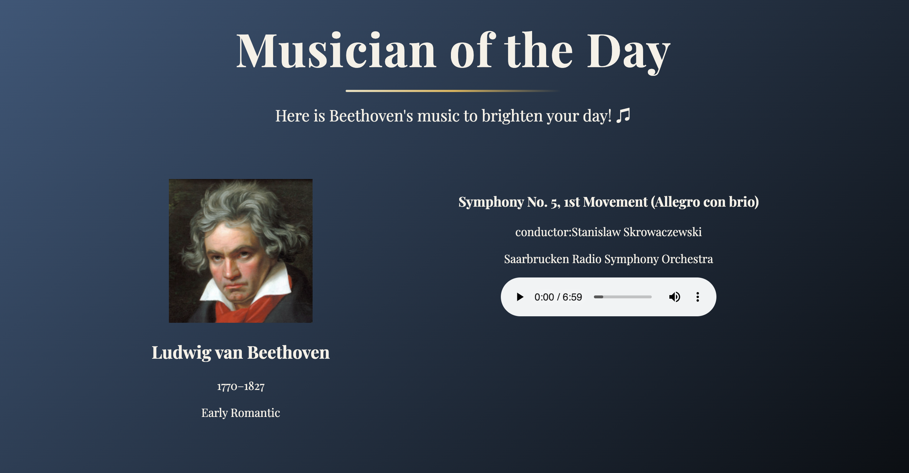

# 🎼 Classical Music Track Viewer

A simple React app that displays classical a music track with composer and performer information.  
The app integrates the [Open Opus API](https://openopus.org/) and local JSON files to show detailed track data.



---

## ✨ Features

- Display featured classical tracks with **composer, music title, and performer(conductor)**
- Dynamic status message  
  _e.g._ “Here is *Beethoven*’s music to brighten your day 🎵”
- Audio playback linked from JSON track data
- Uses **Open Opus API** to fetch composer and music information
- Built with **React + JavaScript**

---

## 🚀 Getting Started

Clone this repo:

```bash
git clone https://github.com/Byungjin-Kim/classical-track-viewer.git

Install dependencies:

npm run dev

```

## 📂 Project Structure
```
src/
  ├── Components/
  │   ├── MusicianCard.jsx
  │   ├── Status.jsx
  │   └── Track.jsx
  ├── data/
  │   └── musicInfo.json
  ├── App.jsx
  ├── App.css
  ├── index.css
  └── main.jsx
public/
  └── (favicon, preview.png, etc.)
```

## 🛠️ Tech Stack
- React
- Vite (build tool)
- JavaScript
- Axios (API requests)
- Open Opus API (composer and track data)

## 🔮 Roadmap

- Add more composers and tracks to enrich the collection  
- Show composer / performer descriptions  
- Improve UI/UX with advanced styling  
- Expand support for additional APIs  


## 📜 License

ℹ️ This project uses free-licensed audio sources.  
All tracks are provided for educational and personal portfolio use only.

This project is licensed under the **MIT License**.
